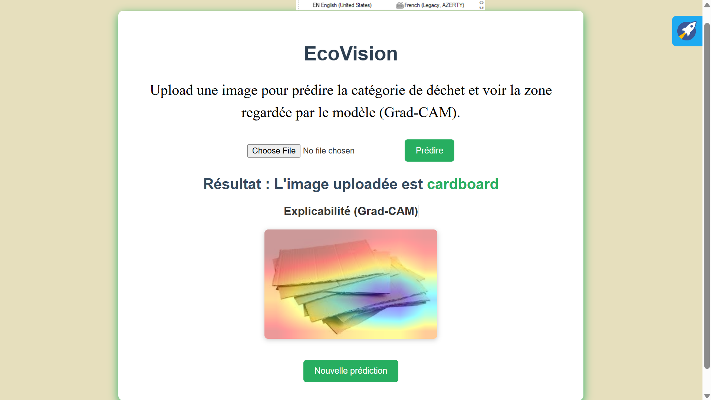

# 🌍 EcoVision — Computer Vision for the Environment

*Ce projet implémente un modèle de **vision par ordinateur** pour classifier des images de déchets en six catégories :  **cardboard, glass, metal, paper, plastic, trash**.  L’application est déployée avec **Flask** et utilise **ONNX Runtime** pour l’inférence, permettant une intégration légère et rapide côté serveur.*

---

## 🎯 Objectifs
- Démontrer l’usage de **CNN pré‑entraînés (ResNet18)** pour la classification environnementale.  
- Illustrer le pipeline complet : preprocessing, entraînement, validation, déploiement.  
- Fournir une interface web simple pour tester le modèle et visualiser les zones d’attention via **Grad‑CAM**.  
- Sensibiliser à la gestion des déchets grâce à l’IA.

---

## 🚀 Utilisation
- Ouvrir l’interface web (par défaut sur `http://127.0.0.1:5000`).  
- Uploader une image de déchet.  
- Obtenir la prédiction de la catégorie et la visualisation Grad‑CAM.

---

## 📊 Résultats
Performance du modèle sur le jeu de test (759 images) :

| Classe     | Précision | Rappel | F1-score | Support |
|------------|-----------|--------|----------|---------|
| cardboard  | 0.99      | 0.94   | 0.96     | 126     |
| glass      | 0.90      | 0.92   | 0.91     | 144     |
| metal      | 0.92      | 0.93   | 0.92     | 118     |
| paper      | 0.98      | 0.99   | 0.98     | 197     |
| plastic    | 0.89      | 0.89   | 0.89     | 133     |
| trash      | 0.90      | 0.88   | 0.89     | 41      |

**Accuracy globale : 94%**  
👉 Le modèle atteint une excellente performance, avec une précision macro‑moyenne de 93%.

---

## 🔮 Améliorations possibles
- Étendre le dataset pour améliorer la robustesse sur la classe *trash*.  
- Expérimenter avec des architectures plus puissantes (EfficientNet, ResNet50).  
- Ajouter de la **data augmentation** pour réduire le sur‑apprentissage.  
- Intégrer un **scheduler de learning rate** pour optimiser la convergence.  
- Déployer sur un service cloud (Azure, AWS, GCP) pour une utilisation à grande échelle.
